# VChat: Data Execution Prevention

*Notice*: The following exploit, and its procedures are based on the original [Blog](https://fluidattacks.com/blog/understanding-dep/).
___

There are a number of protections that systems put in place to prevent or limit the effectiveness of buffer overflows. There are those that attempt to prevent the attacker from gaining control over the flow of execution like [Stack Canaries](https://www.usenix.org/legacy/publications/library/proceedings/sec98/full_papers/cowan/cowan.pdf) which aim to protect the return address. There are also those such as [Address Space Layout Randomization](https://www.ibm.com/docs/en/zos/3.1.0?topic=overview-address-space-layout-randomization) that make it more difficult for for overflows to be successful or locate the addresses of those functions, and libraries they require. With this document we will be focusing on something known as [Data Execution Prevention (DEP)](https://learn.microsoft.com/en-us/windows/security/threat-protection/overview-of-threat-mitigations-in-windows-10#data-execution-prevention), with this protection scheme we set something known as the No eXecute (NX) bit. This is generally a hardware based protection (Software based DEP does exist), and if the NX-bit of a memory page is set the CPU will not allow the execution of instructions located within that memory page as it should be *read-only*. Looking at previous exploits we have heavily relied on being able to execute instructions that we have placed into the stack.

## Exploitation
This writeup will contain two pre-exploit and exploitation sections. This is simply to show the effects of using the DEP protections. Details of creating an exploit for the [TRUN](https://github.com/DaintyJet/VChat_TRUN) command will not be included as this has been done previously.

### No-DEP PreExploitation

1. Within the VirtualBox Settings (If you are using VirtualBox) enable the PAE/NX features for the Windows VM in order to allow this demonstration to work.

   1. Open the VirtualBox Settings for the Windows VM

      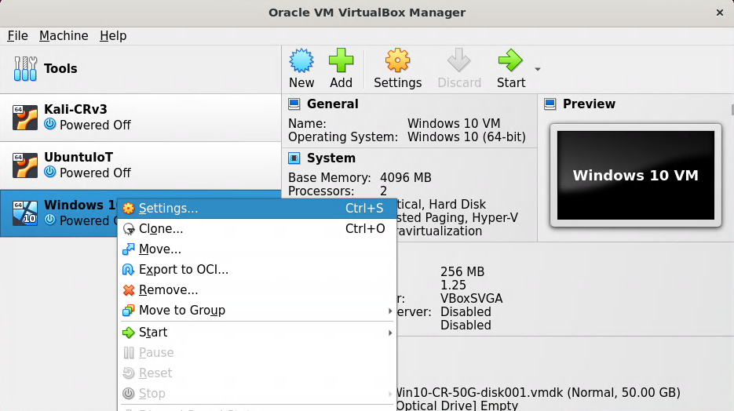

   2. Navigate to the System Section
      
      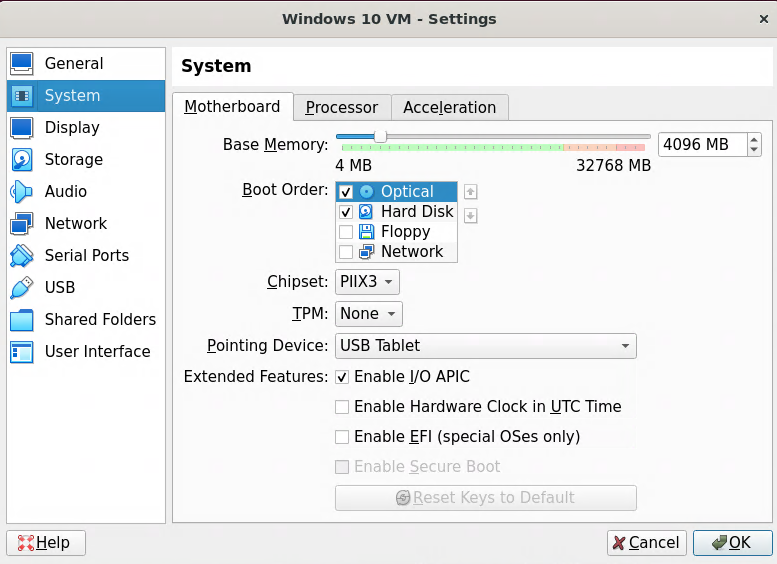

   3. Navigate to the Processor Tab

      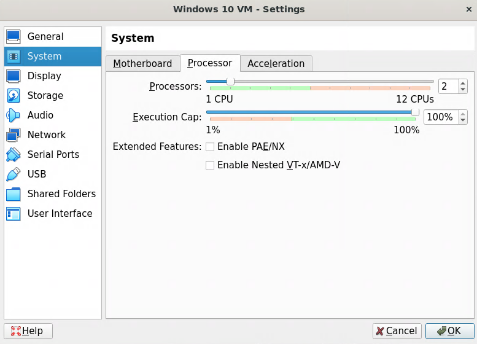

   4. Enable PAE/NX through the clicking the checkbox    

      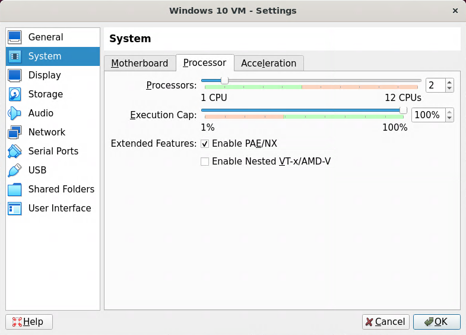 
   

2. **Windows**: Setup Vchat
   1. Compile VChat and it's dependencies if they has not already been compiled. This is done with mingw 
      1. Create the essfunc object File 
		```powershell
		$ gcc.exe -c essfunc.c
		```
      2. Create the [DLL](https://learn.microsoft.com/en-us/troubleshoot/windows-client/deployment/dynamic-link-library) containing functions that will be used by the VChat.   
		```powershell
		# Create a the DLL with an 
		$ gcc.exe -shared -o essfunc.dll -Wl,--out-implib=libessfunc.a -Wl,--image-base=0x62500000 essfunc.o
		```
         * ```-shared -o essfunc.dll```: We create a DLL "essfunc.dll", these are equivalent to the [shared library](https://tldp.org/HOWTO/Program-Library-HOWTO/shared-libraries.html) in Linux. 
         * ```-Wl,--out-implib=libessfunc.a```: We tell the linker to generate generate a import library "libessfunc".a" [2].
         * ```-Wl,--image-base=0x62500000```: We specify the [Base Address](https://learn.microsoft.com/en-us/cpp/build/reference/base-base-address?view=msvc-170) as ```0x62500000``` [3].
         * ```essfunc.o```: We build the DLL based off of the object file "essfunc.o"
      3. Compile the VChat application 
		```powershell
		$ gcc.exe vchat.c -o vchat.exe -lws2_32 ./libessfunc.a
		```
         * ```vchat.c```: The source file is "vchat.c"
         * ```-o vchat.exe```: The output file will be the executable "vchat.exe"
         * ```-lws2_32 ./libessfunc.a```: Link the executable against the import library "libessfunc.a", enabling it to use the DLL "essfunc.dll"
   2. Launch the VChat application 
		* Click on the Icon in File Explorer when it is in the same directory as the essefunc dll
3. **Linux**: Run NMap
	```sh
	# Replace the <IP> with the IP of the machine.
	$ nmap -A <IP>
	```
   * We can think of the "-A" flag like the term aggressive as it does more than the normal scans, and is often easily detected.
   * This scan will also attempt to determine the version of the applications, this means when it encounters a non-standard application such as *VChat* it can take 30 seconds to 1.5 minuets depending on the speed of the systems involved to finish scanning. You may find the scan ```nmap <IP>``` without any flags to be quicker!
   * Example results are shown below:

		

4. **Linux**: As we can see the port ```9999``` is open, we can try accessing it using **Telnet** to send unencrypted communications
	```
	$ telnet <VChat-IP> <Port>

	# Example
	# telnet 127.0.0.1 9999
	```
   * Once you have connected, try running the ```HELP``` command, this will give us some information regarding the available commands the server processes and the arguments they take. This provides us a starting point for our [*fuzzing*](https://owasp.org/www-community/Fuzzing) work.
   * Exit with ```CTL+]```
   * An example is shown below

		

5. **Linux**: We can try a few inputs to the *KSTET* command, and see if we can get any information. Simply type *KSTET* followed by some additional input as shown below

	

	* Now, trying every possible combinations of strings would get quite tiresome, so we can use the technique of *fuzzing* to automate this process as discussed later in the exploitation section.
	* In this case we will do some fuzzing to keep the exploit sections relatively consistent, but as you can see we know crashing this command will not take much!

### No-DEP Exploitation 
We will be preforming a simple overflow against the [TRUN](https://github.com/DaintyJet/VChat_TRUN) command on VChat. This example can be done against any of the other exploitable commands. However *TRUN* was chosen due to it's simplicity. Again this will not be covering the methods we used to determine how we can exploit *TRUN* and the creation of the payload; we only show the final exploitation for a later comparison against a VChat server which has had the DEP protections enabled. There are Hundreds of machine instructions we can chose from depending on the underlying machine architecture, as we are attacking a 32-bit x86 system we can chose a few simple instructions in this attack. In this case we chose the `add`, `mov` and `sub` instructions. If you would like to modify the assembly instructions you can generate the machine code using the command `/usr/share/metasploit-framework/tools/exploit/nasm_shell.rb` on the *Kali Linux* System as has been discussed in other writeups.

1. Compile the necessary machine instructions

	https://github.com/DaintyJet/VChat-DEP/assets/60448620/802bc78d-743c-4beb-aaf0-abce87d0842c

   * `mov ax,0x5555`: Instruction to put 0x5555 into the upper 16 bits
   * `add ax,ax`: Add the value in ax to itself and store the result in ax
   * `sub ax,ax`: Subtract ax from itself and store the result in ax (Should be 0)

2. Add the assembled instructions to the [TRUN](https://github.com/DaintyJet/VChat_TRUN) exploit as shown in [exploit1.py](./SourceCode/exploit1.py). Here we have simply added the assembly instructions to the point in the buffer located after we have returned back to the stack.
3. Attach VChat to the Immunity debugger and run the exploit against our VChat server and observe the results.

	https://github.com/DaintyJet/VChat-DEP/assets/60448620/087314aa-039f-4515-a7a0-0567f5bcd7f4

   1. Click on the black button highlighted below, enter in the address we decided in the previous step

      

   2. Set a breakpoint at the desired address (Right-click)

      

   3. Run the [exploit1.py](./SourceCode/exploit1.py) program till an overflow occurs (See EIP/ESP and stack changes), you should be able to tell by the black text at the bottom the screen that says `Breakpoint at ...`.

      

   4. Step into the JMP instruction and observe the results Notice that our instructions, in this case a `mov`, `add`, and `sub` all have an effect on the registers! This is because we do not have DEP enabled for this VChat process!


### DEP-PreExploitation
To get an idea of how common DEP is on a modern Windows system we can look at all the processes running on our system to see those running with a NX-bit set. This should be a common sight in modern systems and processes!

1. Open Task Manager

   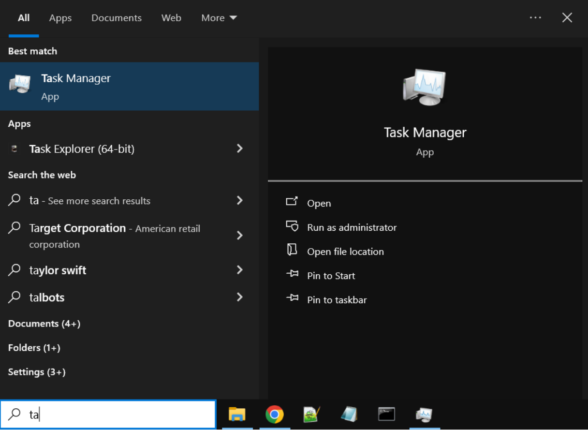

2. Click *More Details*

   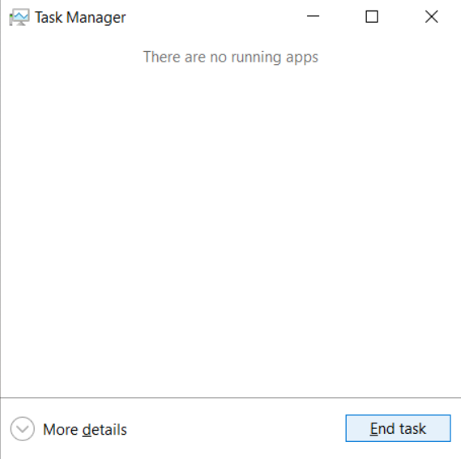

3. Open the Details tab

   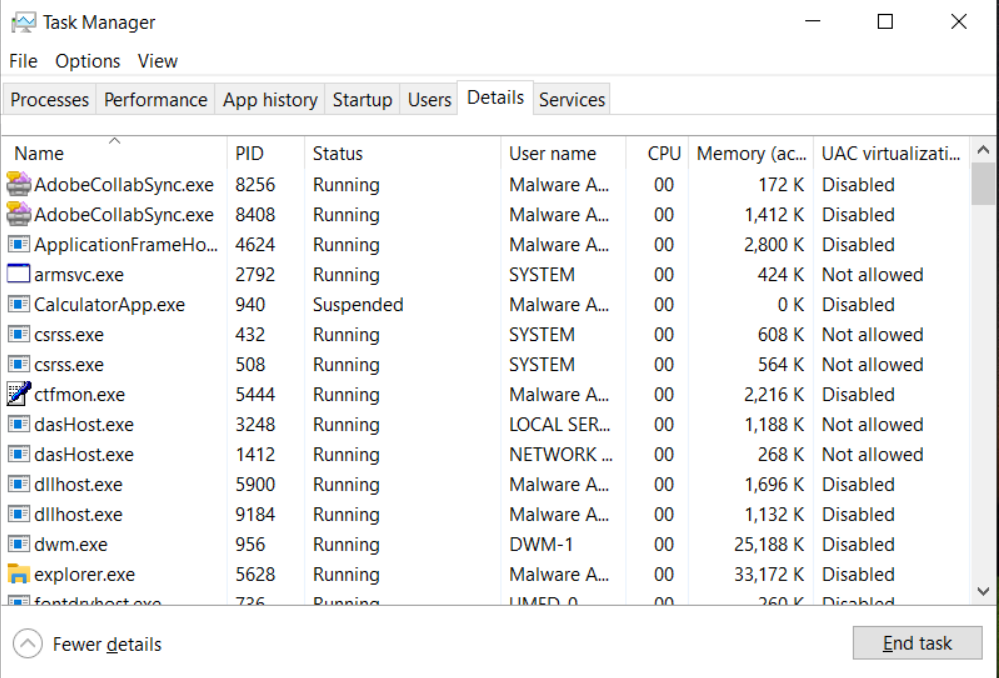

4. Right click a column and click *Select Columns*

   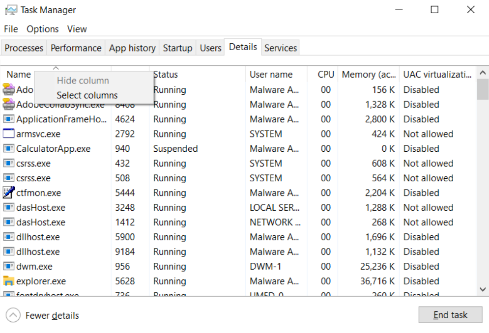

5. Select Data Execution Prevention

   

6. You can now see there are both processes that use DEP, and those that do not use DEP

   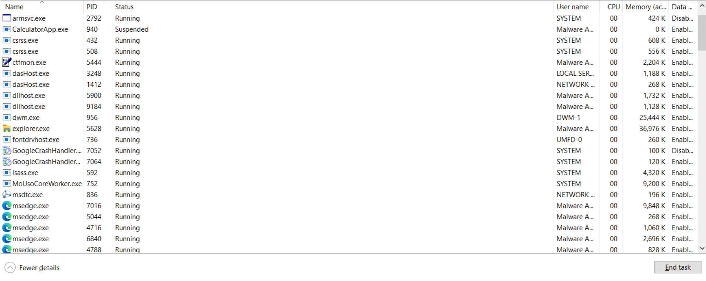

Now we can configure the VChat binary to have the NX-bit set, making it use the DEP features! There are four ways we can do this

#### Compilation/EditBin
1. **Windows**: We must set the NX-bit of the executable, we can recompile the program or use a utility to set the bit. 
   1. Recompile VChat and it's dependencies. This is done with mingw or a command prompt(Search Mingw in the search bar and select *Run Terminal*. in this case searching *mingw* brings up a normal command prompt!)

	https://github.com/DaintyJet/VChat-DEP/assets/60448620/12d8048b-e258-49aa-bee8-fb6a5027e6b4

      1. Create the essfunc object File 
      ```powershell
      $ gcc.exe -c essfunc.c
      ```
      2. Create the [DLL](https://learn.microsoft.com/en-us/troubleshoot/windows-client/deployment/dynamic-link-library) containing functions that will be used by the VChat.   
      ```powershell
      # Create a the DLL with an 
      $ gcc.exe -shared -o essfunc.dll -Wl,--out-implib=libessfunc.a -Wl,--image-base=0x62500000 essfunc.o
      ```
         * ```-shared -o essfunc.dll```: We create a DLL "essfunc.dll", these are equivalent to the [shared library](https://tldp.org/HOWTO/Program-Library-HOWTO/shared-libraries.html) in Linux. 
         * ```-Wl,--out-implib=libessfunc.a```: We tell the linker to generate generate a import library "libessfunc".a" [2].
         * ```-Wl,--image-base=0x62500000```: We specify the [Base Address](https://learn.microsoft.com/en-us/cpp/build/reference/base-base-address?view=msvc-170) as ```0x62500000``` [3].
         * ```essfunc.o```: We build the DLL based off of the object file "essfunc.o"
      3. Compile the VChat application 
      ```powershell
      $ gcc.exe vchat.c -Wl,-nxcompat -o vchat.exe -lws2_32 ./libessfunc.a
      ```
         * ```vchat.c```: The source file is "vchat.c"
         * ```-Wl,-nxcompat```: This enables the DEP Protections
         * ```-o vchat.exe```: The output file will be the executable "vchat.exe"
         * ```-lws2_32 ./libessfunc.a```: Link the executable against the import library "libessfunc.a", enabling it to use the DLL "essfunc.dll"
   2. Use a tool such as [editbin.exe](https://learn.microsoft.com/en-us/cpp/build/reference/editbin-reference?view=msvc-170), you will need to install [Additional MSVC Build Tools](https://learn.microsoft.com/en-us/cpp/build/reference/c-cpp-build-tools?view=msvc-170) in order to use this program.

      1. [Install](https://visualstudio.microsoft.com/downloads) for the appropriate build tools
      2. Open a **Developer Powershell For Visual Studio**
         
         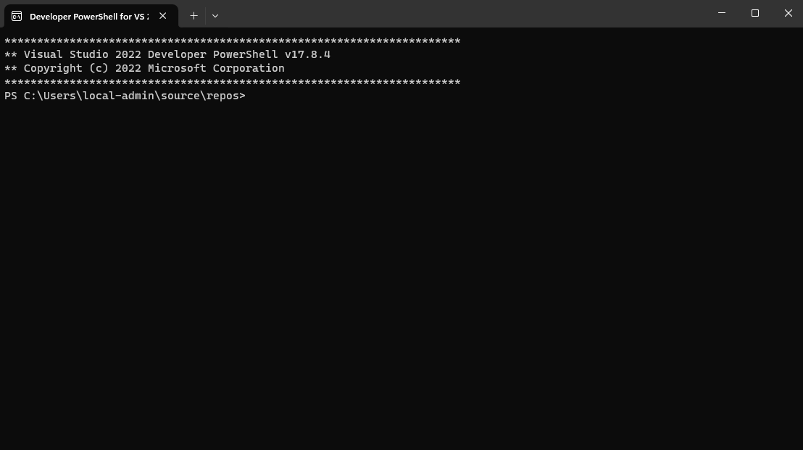

      3. Run the following command
         ```
         $ editbin.exe /NXCOMPAT vchat.exe
         ```

#### System Wide (GUI)
We can (Optionally) modify the Windows settings to enforce Data Execution Protections on all processes; This is a *system-wide* setting. (If you have bitlocker, please do **NOT** do this unless you know what you are doing!)

**Note**: ONLY do this if you have all the required recovery keys such as the bitlocker recovery key. Before the system can fully boot you will be required to enter a Bit-Locker recovery key.

1. Open Windows *view advanced system settings* (Use the search bar)

   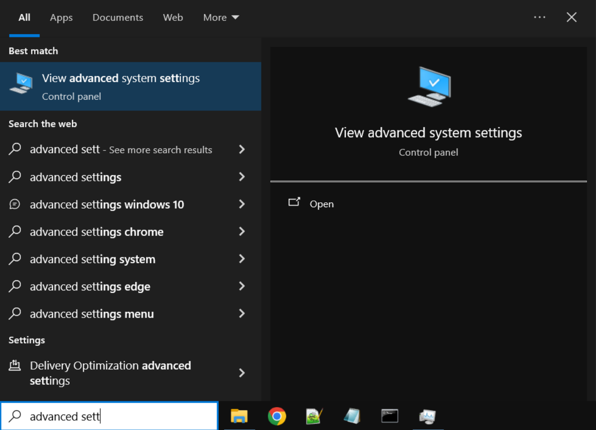

2. Open the *Performance* Settings

   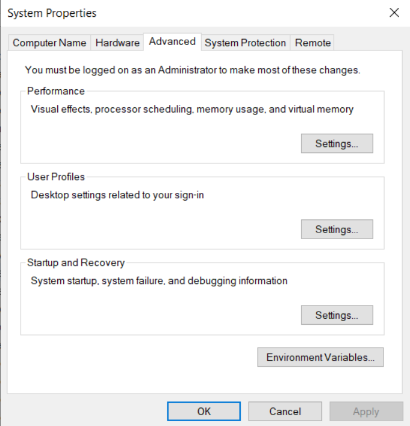

3. Select *Data Execution Protection* and toggle on the *Turn on DEP for all programs and services except those I select:*

   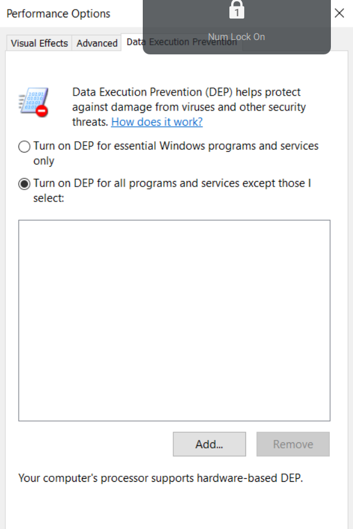

4. Restart the system
   **Note**: ONLY do this if you have all the required recovery keys such as the bitlocker recovery key. Before the system can fully boot you will be required to enter a Bit-Locker recovery key. 

**Additionally** we can also enable this in the *Exploit Protections Settings* as shown below:

1. Open Windows Settings
        
   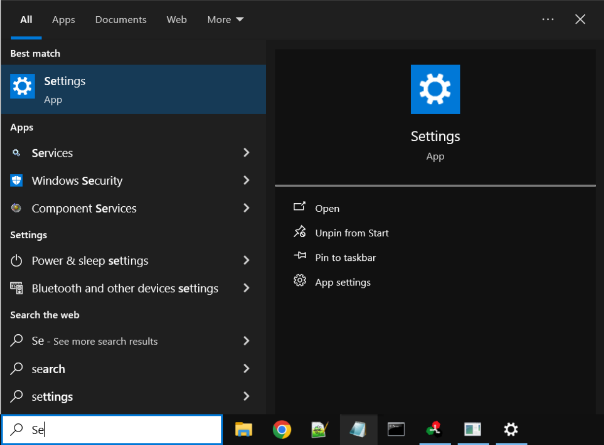
   
2. Search for the Exploit Protection configuration menu.

   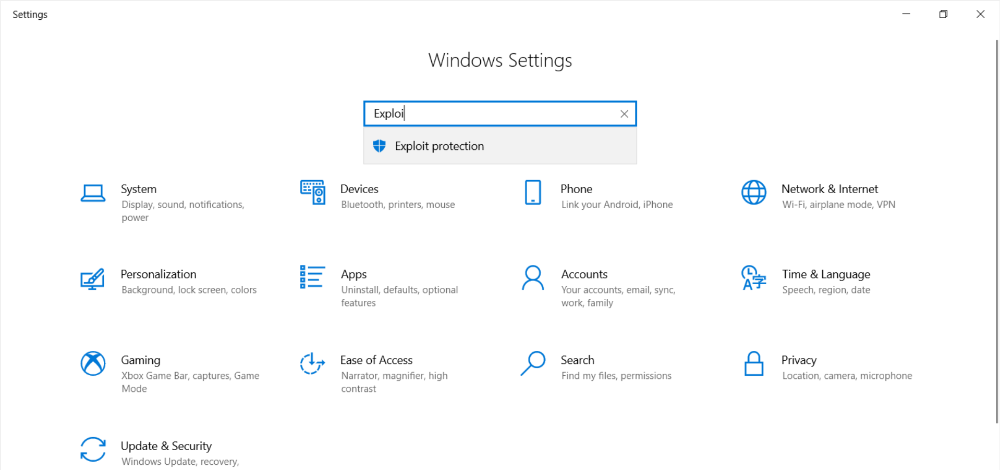

3. Enable DEP by default

   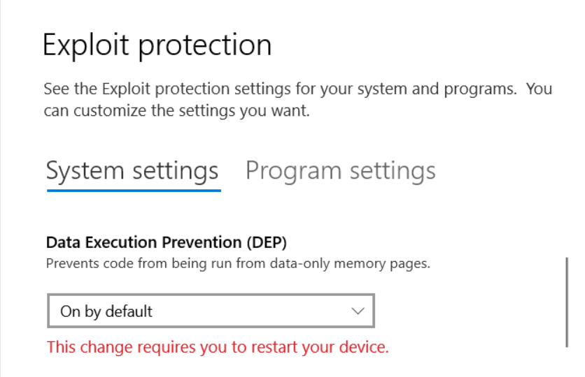

#### System Wide (CLI)
If you would rather use the Command Line Interface (CLI) for this system-wide configuration, you should do the following. This uses the [bcdedit](https://learn.microsoft.com/en-us/windows-server/administration/windows-commands/bcdedit) command line tool to edit the [nx](https://learn.microsoft.com/en-us/windows-hardware/drivers/devtest/boot-parameters-to-configure-dep-and-pae) configurations. 

**Note**: ONLY do this if you have all the required recovery keys such as the bitlocker recovery key. Before the system can fully boot you will be required to enter a Bit-Locker recovery key.

1. Open Powershell as an administrator 

   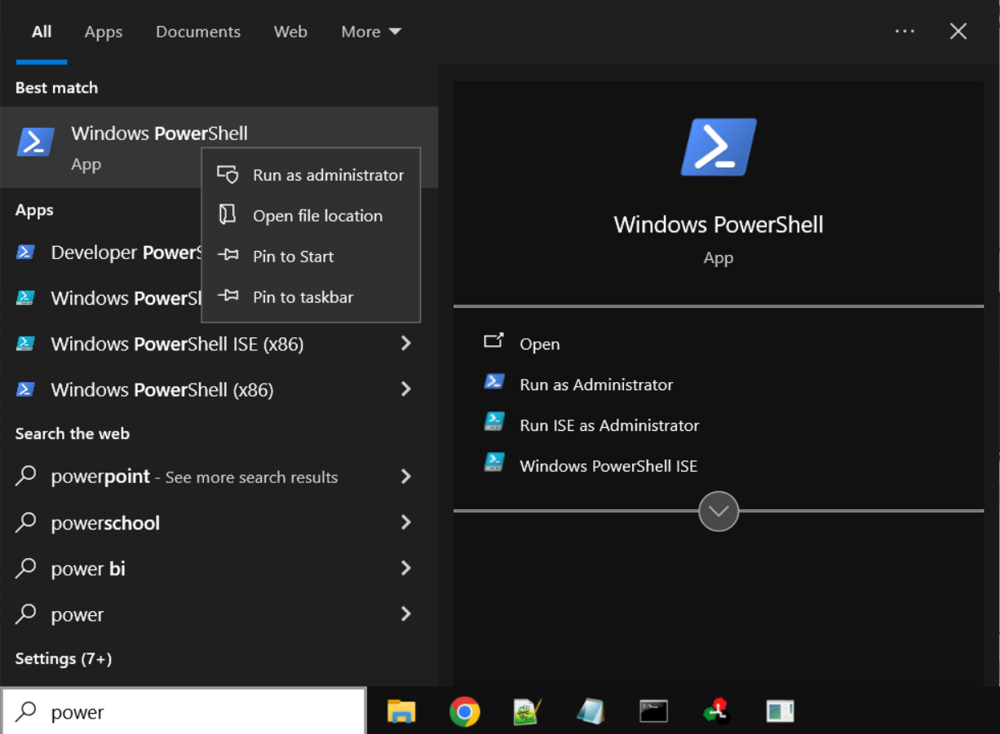

2. Run the following command to enable the NX bit for all processes 
   ```
   $ bcdedit /set nx AlwaysOn
   ```
3.  Restart the computer

If you have attached the VChat Executable to the Immunity debugger you can run `!mona mod` to list all of the modules and their information, you will see something as pictured below; however you **Should not** see the NXBit set to *false*.

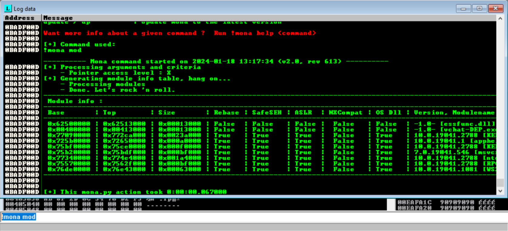

### DEP Exploit

**Note:** DEP protections may not work on Virtual Machines running on specific platforms (Virtualbox Version 7.0). This may require use to run the program on a host system to show this behavior. 

We will use the same [exploit1.py](./SourceCode/exploit1.py) that we compiled for the [No-Dep Exploitation section](#no-dep-exploitation), for details on the commands used please refer to the earlier section.  

1. Attach VChat to the Immunity debugger and run the exploit against our VChat server and observe the results.

	https://github.com/DaintyJet/VChat-DEP/assets/60448620/fd17763a-d89c-4295-8076-327e3abce018

   1. Click on the black button highlighted below, and enter in the address we decided in the previous step

      

   2. Set a breakpoint at the desired address (Right-click)

      

   3. Run the [exploit1.py](./SourceCode/exploit1.py) program till an overflow occurs (See EIP/ESP and stack changes), you should be able to tell by the black text at the bottom the screen that says `Breakpoint at ...`.

      

   4. Step into the JMP instruction and observe the results Notice that our instructions, in this case only the `mov` instruction is reached before an execption is raised. This is because we have DEP protections enabled and this disallows executable commands in certain memory regions such as the stack.

      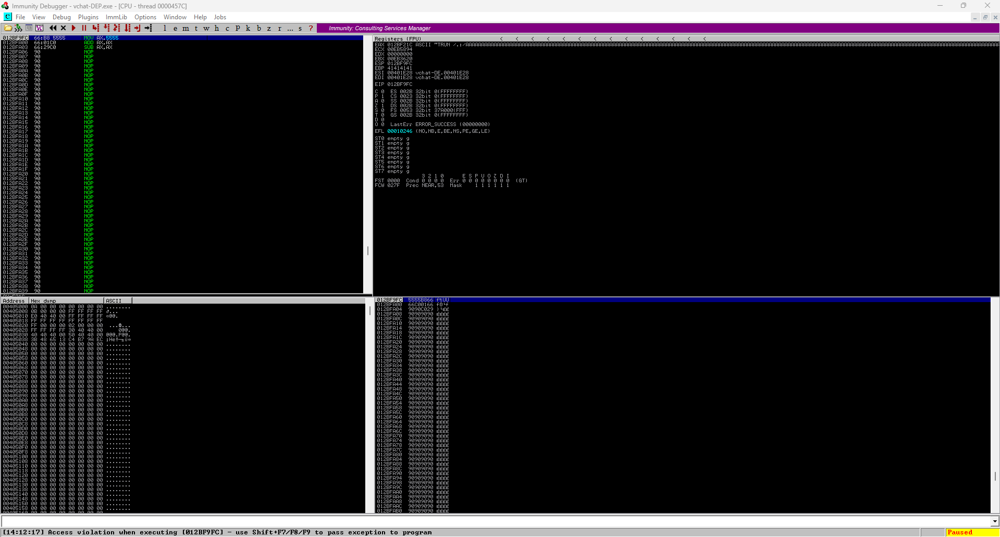

DEP is only one manner of defending against buffer overflows, when it is enabled it only makes preforming an overflow harder. It does not make it impossible, you can enable additional protections such as ASLR and Stack Canaries to make exploitations even harder. However, when DEP is the only protection enabled, we can with relative ease use a technique known as [Return Oriented Programming](https://dl.acm.org/doi/10.1145/2133375.2133377) to overcome the DEP protections. 

## Test code
1. [exploit1.py](SourceCode/exploit1.py): Exploit the [TRUN](https://github.com/DaintyJet/VChat_TRUN) command placing a `mov`, `add`, and `sub` instruction onto the stack.

## References 
[1] https://learn.microsoft.com/en-us/windows/security/threat-protection/overview-of-threat-mitigations-in-windows-10#data-execution-prevention

[2] https://learn.microsoft.com/en-us/windows-hardware/drivers/kernel/no-execute-nonpaged-pool

[3] https://mdanilor.github.io/posts/memory-protections/

[4] https://access.redhat.com/solutions/2936741

[5] https://www.usenix.org/legacy/publications/library/proceedings/sec98/full_papers/cowan/cowan.pdf

[6] https://www.sans.org/blog/stack-canaries-gingerly-sidestepping-the-cage/

[7] https://gist.github.com/jrelo/f5c976fdc602688a0fd40288fde6d886

[8] https://learn.microsoft.com/en-us/windows/win32/memory/physical-address-extension